# BRAIN KIDS

Brain Kids is an educational website for children in their early years of school to build their addition and subtraction math skills in a fun and exciting way. In the future Brain Kids is planning to release new games.

## Table of Content

1. [Project Goals](#project-goals)
   1. [Target Audience](#target-audience)
   2. [User Goals](#user-goals)
   3. [Site Owner Goals](#site-owner-goals)
2. [User Experience (UX)](#user-experience-ux)
   1. [User Requirements and Expectations](#user-requirements-and-expectations)
   2. [User Stories](#user-stories)
   3. [Features To Achieve These Goals](#features-to-achieve-these-goals)
3. [Design](#design)
   1. [Wireframes](#wireframes)
   2. [Logo](#logo)
   3. [Colour Scheme](#colour-scheme)
   4. [Fonts](#fonts)
4. [Structure](#structure)
   1. [Technologies Used](#technologies-used)
   2. [Frameworks](#frameworks)
   3. [Tools](#tools)
5. [Features](#features)
   1. [Header](#header)
   2. [Top Main page](#top-main-page)
   3. [Game Page](#game-page)
   4. [Game Over](#game-over)
   5. [Score Page](#score-page)
   6. [Sign Up Page](#sign-up-page)
   7. [Success Message](#success-message)
   8. [Footer](#footer)
6. [Bugs / Improvements](#bugs--improvements)
   1. [lighthouse](#lighthouse)
   2. [HTML](#html)
   3. [JavaScript](#javascript)
7. [Validation](#validation)
   1. [HTML Validation](#html-validation)
   2. [CSS Validation](#css-validation)
   3. [JavaScript Validation](#javascript-validation)
8. [Lighthouse](#lighthouse-1)
9. [Testing](#testing)
   1. [Device Test](#device-test)
   2. [Browser Test](#browser-test)
   3. [Features Test](#features-test)
   4. [Testing User Stories](#testing-user-stories)
10. [Deployment](#deployment)
    1. [Make Branch](#make-branch)
    2. [Marge The Branch Into Main](#merge-the-branch-into-main)
11. [Reference](#reference)

## Project Goals

The goal of this project is to create an interactive math game for children to enjoy.

### Target Audience

- Children who are in early-year school and just starting to learn basic math skills
- Parents who want their children to build up their addition and subtraction skills

### User Goals

- Children can have fun and learn while playing
- User can get used to calculating addition and subtraction and build their confidence
- It increases in difficulty but also motivates
- Games that parents can safely give to their children (No harmful content)

### Site Owner Goals

- Develop a game that users can play addition and subtraction math game
- Develop a website that is easy to navigate for children and adults
- Provide a game that can help children to learn
- Provide a game that can be played safely for children (No harmful content)
- Set up a subscription service to inform users of more educational games coming in the future

## User Experience (UX)

### User Requirements and Expectations

- Games that can be safely provided to children
- Easy to use
- Responsive on a range of devices
- User Can read and understand numbers between at least 1 to 100
- User Understand basic math operations ( plus and minus)
- User has no hesitation in learning

### User Stories

(Parents side)

1.  As a user, I want to let my children play educational games so they can boost their skills
2.  As a user, I want my children to enjoy learning so that they will see it as a fun activity
3.  As a user, I can use different devices so I can play on a phone or computer
4.  As a user, I can turn on or off the sound so I can choose if I want to hear the music
5.  As a user, I want to give feedback so the game designer knows how people are using their game
6.  As a user, I want to know if there are new games that will be released so I can play them

(children's side)

7. As a user, I want to improve my math skills so I can become more confident
8. As a user, I want to learn but also have fun so I can enjoy learning
9. As a user, I want to see how I am improving my math skills so I know I am getting better

### Features To Achieve These Goals

- Games are only learning-based (User story 1)
- Learning materials are game-based so children can enjoy. There are Sound effects, Audio, and Animation. (User stories 2,8)
- The website uses a responsive design that can be seen on different devices (User stories 3)
- Sound can be on or off (User stories 4)
- Social media icons provided on the footer give the option to users to leave feedback or contact us. Also, BRAIN KIDS provide news (User Stories 5,6)
- There is a sign-up page that can provide notifications of upcoming games to play in the future ( User stories 6)
- Addition and subtraction math game is provided (User stories 7)
- Math game level goes up which gives users more of a challenge (User stories 7)
- Different sound effects and audio have a positive effect on users (User stories 8)
- Scoreboard allows users to show their improvements (User stories 9)

## Design

As this is an educational game website for children it is catered to children, I decided to use bright colours that are cheerful and playful. The pictures in the game are chosen for children who would enjoy seeing the characters but also motivate them to learn.

### Wireframes

[Wireframe Desktop 1](./assets/docs/wireframes/wireframe-large.png)  
[Wireframe Desktop 2](./assets/docs/wireframes/wireframe-large2.png)

[Wireframe Tablet 1](./assets/docs/wireframes/wireframe-tablet.png)  
[Wireframe Tablet 2](./assets/docs/wireframes/wireframe-tablet2.png)

[Wireframe Mobile 1](./assets/docs/wireframes/wireframe-mobile.png)  
[Wireframe Mobile 2](./assets/docs/wireframes/wireframe-mobile2.png)

### Logo

The base logo was found on the [Canva](https://www.canva.com/colors/color-palette-generator/) website. But it wasn’t clear when it was displayed on the website. So I made some changes with Photoshop and made the background transparent to display it better.

### Colour Scheme

The tetradic colour scheme is used for this website.
Based on the colours of the colour chart shown below. Different lightness and opacity are used all over this website.

These different lightness are used for background colours of buttons to give better contrast.

Social media icon colours are referenced from the [U.S BRAND COLOURS](https://usbrandcolors.com/)

### Fonts

The Afacad font style was chosen for this website. It is clear and easy to read. [Google fonts: Afacad](https://fonts.google.com/specimen/Afacad)

## Structure

The structure implemented for this project is a single HTML page that provides different pages.
The top of the page allows the user to access the game page, audio control that can be turned on and off, scoreboard and sign-up page. There are social media icons on the footer to promote this website in the future and allow users to give us feedback or ask questions. The logo has an anchor tag that can lead you to the start game page.

- Game

  The Start Game button will display the actual game screen so that the
  user can play the game.

- Game Over

  Letting users know that the game is over and shows the score they have
  gained. The home button will access the game start page.

- Score

  Provide the highest score and the previous attempt scores. The back
  button has access to go back to the start game page

- Sign Up

  Sign-up allows users to get notifications of upcoming games. after the
  form is filled out and the subscription button is pressed, it leads to a
  success message to give users feedback on their sign-up

### Technologies Used

- HTML
- CSS
- JavaScript

### Frameworks

- [Font Awesome](https://fontawesome.com/icons)
- [Google Fonts](https://fonts.google.com/)
- [Favicon](https://fonts.google.com/)

### Tools

- GitHub
- Visual Studio Code
- Photoshop
- Illustrator

## Features

### Header

- The header shows the logo of Brain Kids which gives the impression that this is a child’s educational website. The sign-up button leads to the sign-up page

This header tells the user the website’s name and what kind of website is. Also, Users know that there is a sign-up section

Desktop

Mobile

### Top Main Page

- The introduction section explains to users what this game is like and explains how to play
- The start button is clearly shown on the screen to start the game
- An audio icon button that can be turned on and off as the user clicks it. When the button is clicked the audio icon will change to show the status of the audio.
- A score button to show the scoreboard
- The image uses children playing with an abacus which gives users the understanding this game is related to mathematics for children

This section provides users with an understanding of the aim of the game. The audio button benefits users by having controls for the sound. To place the score button just under the start button, the user will see that there is a scoreboard feature. They can check their progress between games. With the big red standout start button, users can see at a glance where the start button is to start this game.

### Game Page

- Shows addition and subtraction questions generated by random numbers according to your current level.
- Level is displayed on the top of the question and when the level goes up the colour of the text will change to green for one second
- Score and life points are displayed at the bottom of the question if the answer is correct it will be increased by 1 otherwise it won’t change but the Life points will be decreased.
- On the right-hand side it shows four possible answers that a user needs to pick from.
- A bunny will be shown for 0.7 seconds whether the answer clicked is correct or not
- If the Audio is on, sound effects can be heard depending on what the users have selected whether the answer is correct or not.

Questions can be seen easily by users. When the levels increase the colour of the level text will change to green for one seconds this will let users know that the level is increasing.
Answers are options that can be clicked to make their choice. The user has clear feedback from a little bunny which will pop up to show whether the answer the user clicked was correct or not.
When the audio is on sound effects give the users the same feedback.

[Game page (Mobile) image](./assets/docs/features/game-mobile.png)

[Level up image](./assets/docs/features/levelup.png)

[Correct - bunny image](./assets/docs/features/bunny-correct.png)

[Wrong - bunny image](./assets/docs/features/bunny-wrong.png)

### Game Over

- Show the message “Game Over” on the screen and the score the user has gained for this attempt under it.
- The home button is to go back to the main page where you can start the game again as well as access the other pages.

This provides the user with clear feedback that the game is over. By checking the score user can confirm how many questions they answered correctly in this attempt. The red background Home button is a clear navigation for the user to go back to the main page where they have access to do the game again, check the score, change the audio setting or sign up for a subscription.

[Game over (Mobile) image](./assets/docs/features/gameover-mobile.png)

### Score Page

- The highest score is shown at the top of the page. This is stored in local storage so that it won’t be deleted until the reset all button on the right side is clicked or the page is closed.
- Attempt score is stored in an array so it will add the score every time the game is finished. It will disappear if you reload the page.
- The logo at the top of the page will refresh and clear if the screen is closed. The reset all button will also remove the attempt scores.
- Back button brings you back to the main page
- The Reset All button deletes the highest score and attempt score.

This benefits the users as they can see how their scores are improving by checking the scoreboard.

[Scoreboard (Mobile) image](./assets/docs/features/scoreboard-mobile.png)

### Sign Up Page

- The sign-up form collects the first name, last name and email address of the user. Then they can get newsletters of upcoming games.
- Users can not submit the form until they fill out the form fully
- Click the submit button to submit the form
- The home button at the top will bring you back to the home page

This benefits users whose parents want to let their children learn things in a fun way as they get newsletters that keep them informed about our upcoming new games.

[Sign Up (Mobile) image](./assets/docs/features/signup-mobile.png)

[Home button image](./assets/docs/features/home-btn.png)

### Success Message

- This screen comes out after submitting a form as a confirmation to let the user know that the form has been successfully submitted. The name that they typed is shown on the message.
- The Home button can go back to the main page

This benefits users by letting them know that the form is successfully submitted. The user's name will be included in the message making it seem more familiar.

[Success message (Mobile) image](./assets/docs/features/success-mobile.png)

### Footer

- Three social media icons are on the footer this allows users to give feedback on this website or game. They also inform people of news like upcoming games or updating the website.

This benefits users by informing us of feedback and also showing how we can be contacted.

[Footer (Mobile) image](./assets/docs/features/footer-mobile.png)

## Bugs / Improvements

### Lighthouse

The lighthouse feature in Google Chrome shows the issue of having some buttons that have low-contrast text. This brings the accessibility score down.

To solve this, I followed the advice and changed the lightness of the background colour of the buttons. And the accessibility score went up to 100%.

### HTML

HTML validation gave me the issue of an empty heading. I didn’t write any word intentionally at the beginning as this will be generated by JavaScript. Instead of emptying this, I wrote a draft in the heading in case JavaScript cannot work to show the text.

### JavaScript

There was a warning when my JavaScript file was tested saying the body of a for in should be wrapped in an if statement to filter unwanted properties from the prototype.

I searched [Stack overflow](https://stackoverflow.com/questions/1963102/what-does-the-jslint-error-body-of-a-for-in-should-be-wrapped-in-an-if-statemen) and it recommends using an older style for loop to solve the issue. So I rewrote the code again and it got rid of the warning.

There are warnings. The signupBtn and the StartPage variables are undefined
To fix it, I found a solution using [W3School](https://www.w3schools.com/js/js_modules.asp) that import, export and module methods can share the variables across the files. So I did try it out. This successfully solves the problem.

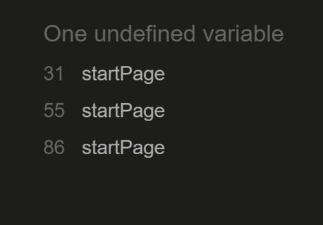

## Validation

As all of the issues were resolved the HTML, CSS, and JavaScript validation all passed.

### [HTML Validation](https://validator.w3.org/#validate_by_uri)

### [CSS Validation](https://jigsaw.w3.org/css-validator/)

### [JavaScript Validation](https://jshint.com/)

The JSHint validator has no error.

However, there are warnings.
Warning saying Function declared within loops referencing an outer scoped variable may lead to confusing semantics. I decided to ignore the warning as this was just a warning and it didn’t have any impact on the project.

(game.js)

(signup.js)

## Lighthouse

Both desktop and mobile scores were nearly 100 %

## Testing

### Device test

Tested with Mobile, tablet, laptop and desktop all worked

### Browser test

Google Chrome, Microsoft Edge, Mozilla Firefox

### Features test

- Tested start button works
- Tested audio button can be turned on or off
- Tested Score button to show the scoreboard and hide the main screen
- Tested Sign Up button to show the sign-up form
- Tested the sign-up form to make sure it cannot be submitted unless filled out
- Tested Submit button works and opens the success message
- Tested success message has the value of the user's first name and last name rendered on the screen
- Tested the Home button to show the main screen and hide unnecessary elements
- Tested questions are generated randomly
- Tested level goes up. At level 0, after 5 correct questions, it will go up a level. After that, for every 6 correct questions, it will increase the level by 1
- Tested score goes up by 1 if you click the correct answer otherwise do nothing
- Tested lives are at 3 when the game starts. and goes down by one every time you click a wrong answer
- Tested if the wrong answer is clicked 3 times, the game over screen shows up
- Tested the score of the game and that it shows correctly when the game is over
- Tested the home button hides the game over page and shows the main page
- Tested Highest score shows and won’t be gone unless the Reset All button is clicked
- Tested attempt score shows and adds every time the game is finished (They are in an array so the data will be gone if the page is reloaded)
- Tested the Reset All button deletes both the highest score and the attempt scores
- Tested the Back button to show the main page and hide unnecessary elements
- Tested all the social media icons open up in an external tab

### Testing User Stories

**1. As a user, I want to let my children play educational games**
| Feature | Action | Expected Result | Actual Result |
|-----------|-------------------------------------------------------------------|----------------------------------------------|------------------|
| Math game | Math game works with no errors that stop users from playing play. | User can enjoy playing the game as expected. | Work as expected |

Math Game

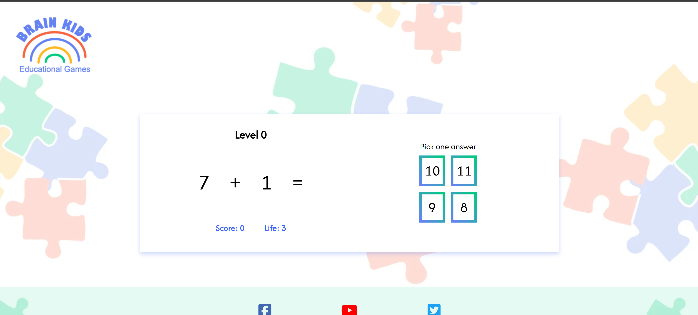</img> 
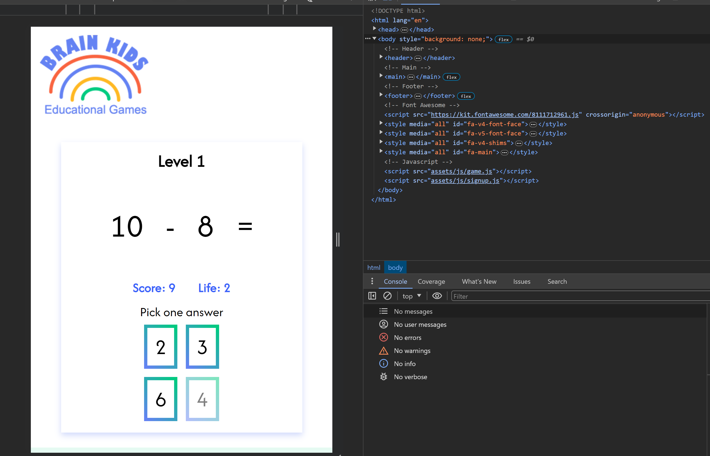</img> 

 

**2. As a user, I want my children to enjoy learning**
| Feature | Action | Expected Result | Actual Result |
|---------------------------------|--------------------------------------------------------------------------------------------------------------------------------------------------------------------|----------------------------------------------------------------------------------------------------------------|------------------|
| Sound effects, Audio, Animation | After clicking the answer, 2 types of little bunnies will show depending on if the answer is correct or incorrect. A sound effect will play when the audio is on. | Users can see a bunny after clicking the answer. They can hear different sound effects depending on the answer | Work as expected |

Animation

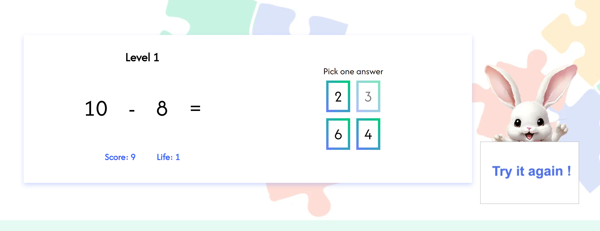</img> 
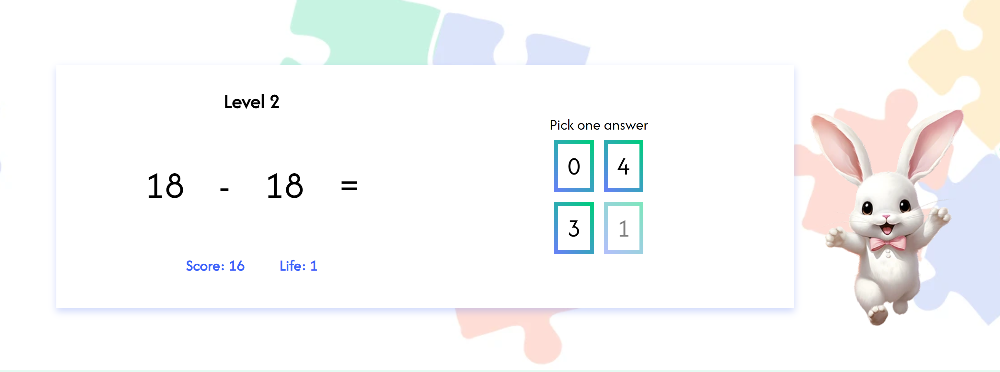</img> 

 

**3. As a user, I can use different devices**
| Feature | Action | Expected Result | Actual Result |
|--------------|----------------------------------------------|------------------------------------------------------------|------------------|
| Media query | Screen changes according to the screen size. | User can use mobile, tablet, laptop and desktop computers. | Work as expected |

Different devices

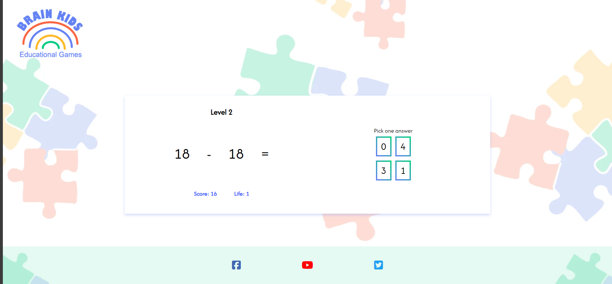</img> 
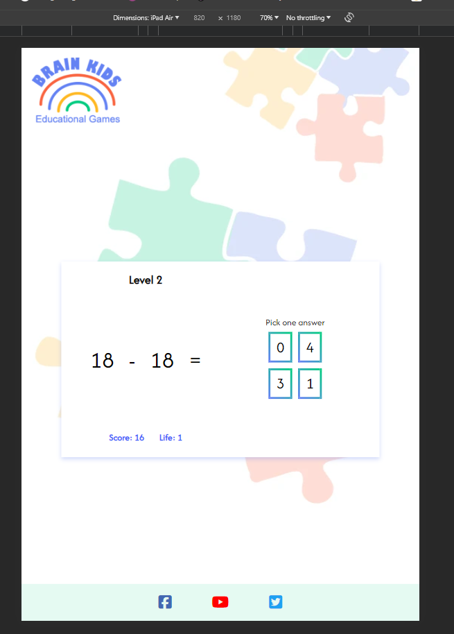</img> 
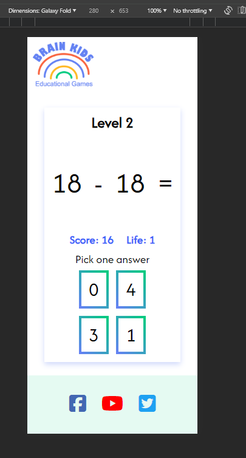</img> 

 

**4. As a user, I can turn on or off the sound**
| Feature | Action | Expected Result | Actual Result |
|--------------------------------------|-----------------------------------------------------------------------|---------------------------------------|------------------|
| Audio button can be turned on or off | Click the audio button on the main page to turn the audio on and off. | Users can have control over the sound | Work as expected |

Audio

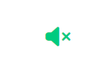</img> 
</img> 

 

**5. As a user, I want to give feedback**
| Feature | Action | Expected Result | Actual Result |
| ------------------ | ----------------------------------------------------------------------------------------------------------------------- | ------------------------------------------------------------------------------------------------------------ | ---------------- |
| Social Media icons | Social media icons provided in the footer give the option for users to leave feedback or contact us. They provide news. | User can click to open the social media icons on the footer and be taken to the respective social media site | Work as expected |

Social Media icons

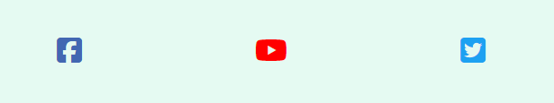</img> 
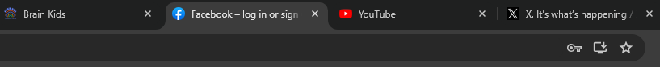</img> 

 

**6. As a user, I want to know if there are new games that will be released**
| Feature | Action | Expected Result | Actual Result |
|----------------|----------------------------------------------------------------------------------------------|----------------------------------------------------------------------------------------------|------------------|
| Sign-up page | The sign-up button opens the sign-up page and a confirmation will be shown after signing up. | Users can sign up to get newsletters. Confirmation will be shown after the form is submitted | Work as expected |

Sign Up

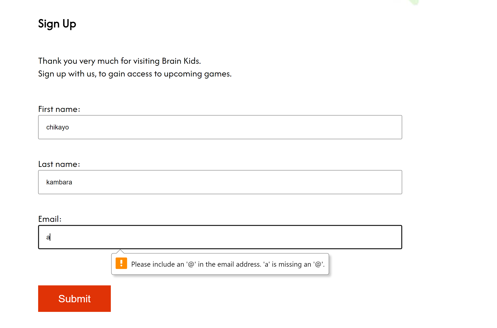</img> 
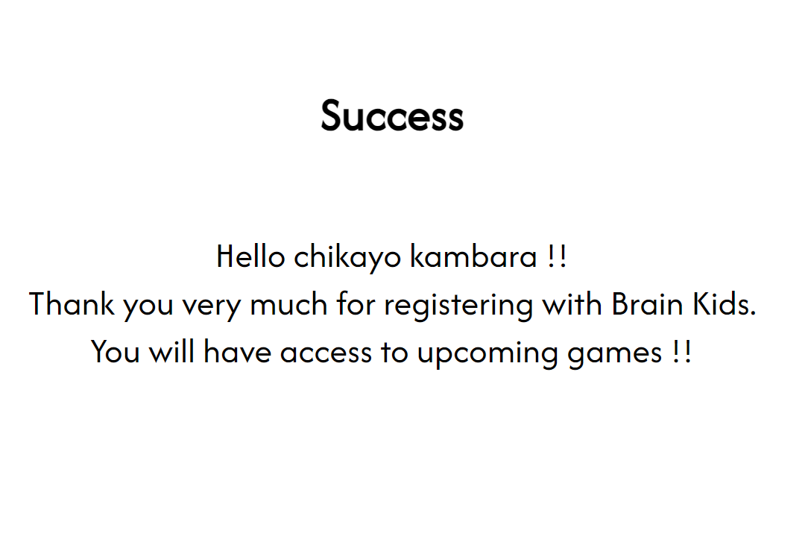</img> 

 

**7 As a user, I want to improve my math skills**
| Feature | Action | Expected Result | Actual Result |
|----------|------------------------------------------------------------------------------------------------------------------------------------------|----------------------------------------------------------------------------------------|------------------|
| Level up | At level 0, after 5 correct questions, it will go up a level. After that, for every 6 correct questions, it will increase the level by 1 | User can see a bunny after clicking the answer. Also can hear different sounds effects | Work as expected |

Level Up

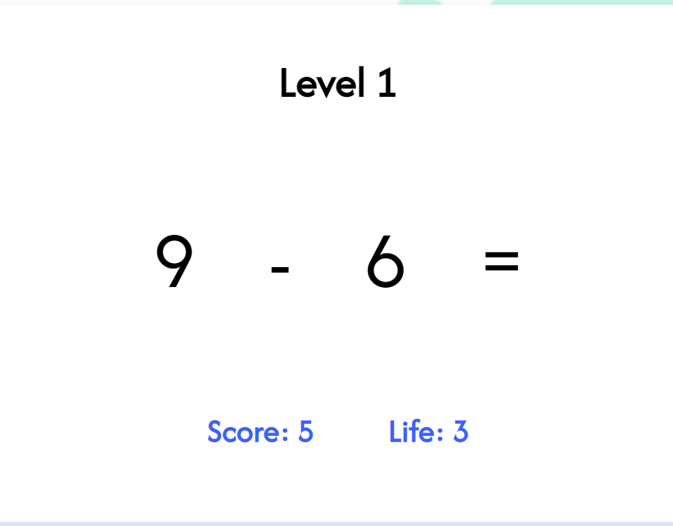</img> 
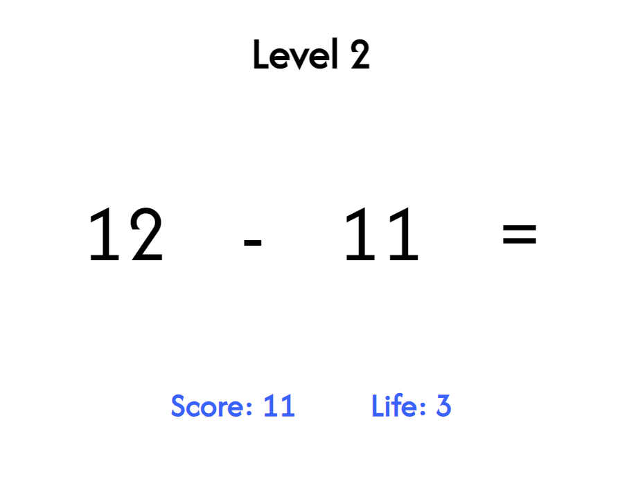</img> 

 

**8 As a user, I want to learn but also have fun**
| Feature | Action | Expected Result | Actual Result |
|---------------------------------|------------------------------------------------------------------------------------------------------------------------------------------------------------------------------------------------------|--------------------------------------------------------------------------------------------------------------------------------------|------------------|
| Sound effects, Audio, Animation | After clicking the answer, 2 types of little bunnies show one for a correct answer and another for the incorrect answer. Correct answers and levelling up will also play sound effects if the sound is on. | Users can see bunnies after clicking the answer. Sound effects when the audio is on make children have a more enjoyable experience | Work as expected |

Animation, Audio

</img> 
</img> 
</img> 

 

**9. As a user, I want to see how I am improving my math skills**
| Feature | Action | Expected Result | Actual Result |
|-----------|---------------------------------------------------------------------|-------------------------------------------------------|------------------|
| Scoreboard | The scoreboard button allows users to show and check their scores. | User can see their results and also the highest score | Work as expected |

Scoreboard

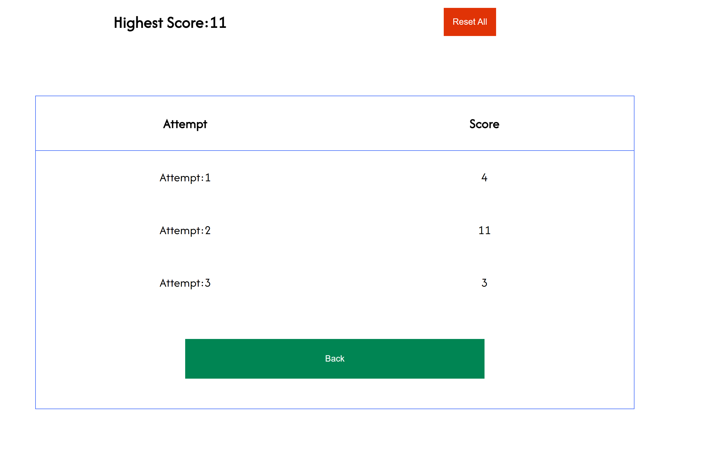</img> 
</img> 

 

## Deployment

1. Open the setting page of the project’s GitHub repository
2. Click the Pages tab on the left-hand side of the menu
3. Build and deployment section, set the source to deploy from a branch
4. make sure to select the main branch as the deployment source, the folder is set to root and save it.
5. Click the code tab and It will show the environment on the right-hand side of the project page in a few minutes. I recommend refreshing the page.
6. Inside that, the URL can be opened and the web page is deployed.

### Make Branch

1. Click branch.
2. Create a branch using the main branch as the source give it a name specific to the feature being developed on the branch.
3. Refresh the page and I can see the newly created branch
4. Go to the workspace to check where in the repository I am using git status.
5. Using git branch -a I can see what branches are available locally.
6. I can’t see the branch I created so I need to use a git fetch
7. The newly created branch is pulled using git checkout with the new branch name to switch from the current branch to the new branch

### Merge The Branch Into Main

1. Once I have finished working on the new branch and have pushed the code, I see the compare and pull request at the top.
2. I click it and review code changes and add a description
3. I Click Merge pull request and confirm the merge
4. I will see a success message showing that the merge was a success
5. Check main for the new changes and that the deployment is working
6. I open the VS code git bash terminal
7. git status ( make sure the branch is up to date)
8. I am no longer working on the new branch so I want to switch back to the main branch
9. git checkout main ( switch to the main branch)
10. New files aren't here. Do a git pull origin main – to pull the new changes to the local repository
11. Run the project and test the new changes that have been applied

## Reference

**Pictures, Audios, Sounds, Logo**  
[Pexcels](https://www.pexels.com/)  
[Pixabay](https://pixabay.com/ja/)  
[Canva](https://www.canva.com/colors/color-palette-generator/)  
[Adbe Colour](https://color.adobe.com/create/color-wheel)

**Make branch, Marge branch**  
[Git commands](https://www.atlassian.com/git/tutorials/atlassian-git-cheatsheet)

**HTML, CSS, JavScript**  
I used Code Institute study materials and the Math walkthrough project in coming up with the idea for my project. I used w3schools to check how to write code as well as the different types of methods that were available in JavaScript. When I run into an issue I use the Stack overflow website to troubleshoot and solve the issue.  
[w3schools](https://www.w3schools.com/)  
[stackoverflow](https://stackoverflow.com/)

**Shuffle an array**  
[Medium - shuffling an Array](https://medium.com/@apestruy/shuffling-an-array-in-javascript-8fcbc5ff12c7)

**Remove ES6 features warnings in JShint**  
[treehouse](https://teamtreehouse.com/community/why-does-jshint-give-me-these-warnings-about-es6)
