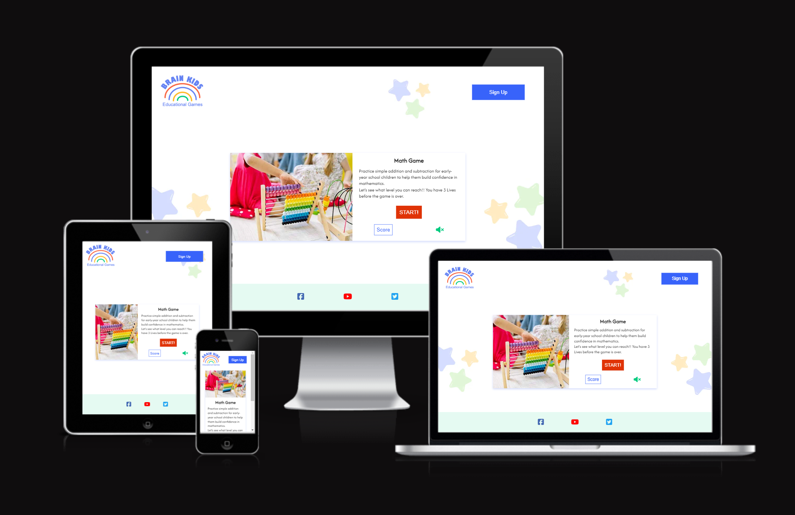

# BRAIN KIDS

Brain Kids is an educational website for children in their early years of school to build their addition and subtraction math skills in a fun and exciting way. In the future Brain Kids is planning to release new games.

## Project Goals

The goal of this project is to create an interactive math game for children to enjoy.

### Target Audience

- Children who are in early-year school and just starting to learn basic math skills
- Parents who want their children to build up their addition and subtraction skills

### User Goals

- Children can have fun and learn while playing
- User can get used to calculating addition and subtraction and build their confidence
- It increases in difficulty but also motivates
- Games that parents can safely give to their children

### Site Owner Goals

- Develop a game that users can play addition and subtraction math game
- Develop a website that is easy to navigate for children and adults
- Provide a game that can help children to learn
- Provide a game that can be played safely for children
- Set up a subscription service to inform users of more educational games coming in the future

## User Experience (UX)

### User Requirements and Expectations

- Games that can be safely provided to children
- Easy to use
- Responsive on a range of devices
- User Can read and understand numbers between at least 1 to 100
- User Understand basic math operations ( plus and minus)
- User has no hesitation in learning

### User Stories

(Parents side)

1.  As a user, I want to let my children play educational games so they can boost their skills
2.  As a user, I want my children to enjoy learning so that they will see it as a fun activity
3.  As a user, I can use different devices so I can play on a phone or computer
4.  As a user, I can turn on or off the sound so I can choose if I want to hear the music
5.  As a user, I want to give feedback so the game designer knows how people are using their game
6.  As a user, I want to know if there are new games that will be released so I can play them

(children's side)

7. As a user, I want to improve my math skills so I can become more confident
8. As a user, I want to learn but also have fun so I can enjoy learning
9. As a user, I want to see how I am improving my math skills so I know I am getting better

### Features To Achieve These Goals

- Games are only learning-based (User story 1)
- Learning materials are game-based so children can enjoy (User stories 2,8)
- The website uses a responsive design that can be seen on different devices (User stories 3)
- Sound can be on or off (User stories 4)
- Social media icons provided on the footer give the option to users to leave feedback or contact us. Also, BRAIN KIDS provide news (User Stories 5,6)
- There is a sign-up page that can provide notifications of upcoming games to play in the future ( User stories 6)
- Addition and subtraction math game is provided (User stories 7)
- Different sound effects and audio have a positive effect on users (User stories 8)
- Math game level goes up which gives users more of a challenge (User stories 9)
- Scoreboard allows users to show their improvements (User stories 9)

## Design

As this is an educational game website for children it is catered to children, I decided to use bright colours that are cheerful and playful. The pictures in the game are chosen for children who would enjoy seeing the characters but also motivate them to learn.

### Logo

The base logo was found on the [Canva](https://www.canva.com/colors/color-palette-generator/) website. But it wasn’t clear when it was displayed on the website. So I made some changes with Photoshop and made the background transparent to display it better.

### Colour Scheme

The tetradic colour scheme is used for this website.
Based on the colours of the colour chart shown below. Different lightness and opacity are used all over this website.

These different lightness are used for background colours of buttons to give better contrast.

Social media icon colours are referenced from the [U.S BRAND COLOURS](https://usbrandcolors.com/)

### Fonts

The Afacad font style was chosen for this website. It is clear and easy to read. [Google fonts: Afacad](https://fonts.google.com/specimen/Afacad)

